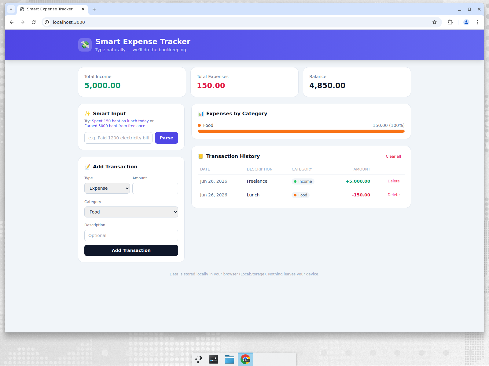

# Smart Expense Tracker

A modern, self-contained single-page web app for tracking income and expenses.
Type transactions in plain English, see a live dashboard, and keep everything in
your browser — no account, no backend, no data leaving your device.



## Features

- **Dashboard** — Total Income, Total Expenses, and Balance at a glance.
- **Category breakdown** — animated progress bars showing where your money goes
  (Food, Travel, Bills, Shopping, Entertainment, Health, Other).
- **Smart Input** — type natural language and it adds the transaction in one click
  (when no amount is detected, it falls back to pre-filling the manual form):
  - `Spent 150 baht on lunch today` → Expense · Food · 150 · "Lunch"
  - `Earned 5000 baht from freelance` → Income · Income · 5000 · "Freelance"
  - `Paid 1,250.50 for rent` → Expense · Bills · 1250.50 · "Rent"
  - `Received 5k salary` → Income · Income · 5000 · "Salary"
- **Manual form** fallback for full control.
- **Transaction history** table with per-row delete and "Clear all".
- **LocalStorage persistence** — data survives refreshes and restarts.
- **Responsive** — works on mobile, tablet, and desktop.

## Tech

- HTML + [Tailwind CSS](https://tailwindcss.com/) (via CDN)
- Vanilla JavaScript (no build step, no framework)
- Optional zero-dependency Node static server for local serving

## Run it

The app is fully static. Either open `index.html` directly in a browser, or
serve it:

```bash
npm start        # serves at http://localhost:3000
```

## Natural-language parsing

The parser lives in `parser.js` and is shared between the browser and the test
suite. It extracts:

- **Amount** — supports `1,250.50`, `5k`, currency words like `baht`/`thb`.
- **Type** — income vs. expense, inferred from verbs (`earned`, `spent`, …).
- **Category** — keyword matching (lunch→Food, taxi→Travel, rent→Bills, …).
- **Description** — the remaining meaningful words.

## Tests

```bash
npm test         # runs the Node built-in test runner against parser.js
```

## Project structure

```
index.html      # markup + Tailwind
app.js          # UI logic, rendering, LocalStorage
parser.js       # natural-language parser (shared, testable)
parser.test.js  # parser unit tests
server.js       # optional static file server (zero deps)
```
